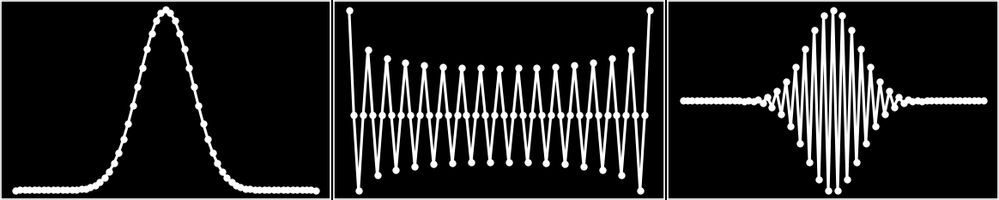

# DiscreteHO.jl




`DiscreteHO.jl` stands for _**Discrete** **H**armonic **O**scillator_, meaning that this package contains the methods, procedures and functions who are related to the discretization of the harmonic oscillator. The discretization is based on the analytical properties of the compact algebra _su(2)_.

The aim of the package is, at first, provide the functions who define the related discrete system. This is because, although there exists packages who treat some aspects of the methods here presented, they are dispersed and not in a fully functional form. This little package has the purpose to be the one who integrates the definitions and procedures.

### Usage

At this point, there is one principal function named (capital)-Phi, who returns the value at position _q_ of the mode _n_, with the parameter _j_ determining the size of the representation. There exists _2j + 1_ points for every integer _j_.

```julia
julia> Φ # Φ(n, q, j)
Φ (generic function with 1 method)

julia> Φ(0, 0, 16)
0.3857894177263653
        
julia> lineplot(
            range(-16, stop = 16), [Φ(0,q,16) for q in -16:16], 
            border=:none, xlim = [-16,16]
        ) # (Unicode)Plotting the first mode at n = 0, for j = 16
 
   0.4  ⠀⠀⠀⠀⠀⠀⠀⠀⠀⠀⠀⠀⠀⠀⠀⠀⠀⠀⢀⡠⡧⡀⠀⠀⠀⠀⠀⠀⠀⠀⠀⠀⠀⠀⠀⠀⠀⠀⠀⠀  
        ⠀⠀⠀⠀⠀⠀⠀⠀⠀⠀⠀⠀⠀⠀⠀⠀⠀⢀⠎⠀⡇⠘⡄⠀⠀⠀⠀⠀⠀⠀⠀⠀⠀⠀⠀⠀⠀⠀⠀⠀  
        ⠀⠀⠀⠀⠀⠀⠀⠀⠀⠀⠀⠀⠀⠀⠀⠀⠀⡎⠀⠀⡇⠀⠸⡀⠀⠀⠀⠀⠀⠀⠀⠀⠀⠀⠀⠀⠀⠀⠀⠀  
        ⠀⠀⠀⠀⠀⠀⠀⠀⠀⠀⠀⠀⠀⠀⠀⠀⡸⠀⠀⠀⡇⠀⠀⢣⠀⠀⠀⠀⠀⠀⠀⠀⠀⠀⠀⠀⠀⠀⠀⠀  
        ⠀⠀⠀⠀⠀⠀⠀⠀⠀⠀⠀⠀⠀⠀⠀⢠⠃⠀⠀⠀⡇⠀⠀⠘⡄⠀⠀⠀⠀⠀⠀⠀⠀⠀⠀⠀⠀⠀⠀⠀  
        ⠀⠀⠀⠀⠀⠀⠀⠀⠀⠀⠀⠀⠀⠀⠀⡎⠀⠀⠀⠀⡇⠀⠀⠀⢣⠀⠀⠀⠀⠀⠀⠀⠀⠀⠀⠀⠀⠀⠀⠀  
        ⠀⠀⠀⠀⠀⠀⠀⠀⠀⠀⠀⠀⠀⠀⢰⠁⠀⠀⠀⠀⡇⠀⠀⠀⠈⡇⠀⠀⠀⠀⠀⠀⠀⠀⠀⠀⠀⠀⠀⠀  
        ⠀⠀⠀⠀⠀⠀⠀⠀⠀⠀⠀⠀⠀⠀⡇⠀⠀⠀⠀⠀⡇⠀⠀⠀⠀⠸⡀⠀⠀⠀⠀⠀⠀⠀⠀⠀⠀⠀⠀⠀  
        ⠀⠀⠀⠀⠀⠀⠀⠀⠀⠀⠀⠀⠀⡸⠀⠀⠀⠀⠀⠀⡇⠀⠀⠀⠀⠀⢇⠀⠀⠀⠀⠀⠀⠀⠀⠀⠀⠀⠀⠀  
        ⠀⠀⠀⠀⠀⠀⠀⠀⠀⠀⠀⠀⢠⠃⠀⠀⠀⠀⠀⠀⡇⠀⠀⠀⠀⠀⠘⡄⠀⠀⠀⠀⠀⠀⠀⠀⠀⠀⠀⠀  
        ⠀⠀⠀⠀⠀⠀⠀⠀⠀⠀⠀⠀⡞⠀⠀⠀⠀⠀⠀⠀⡇⠀⠀⠀⠀⠀⠀⢱⠀⠀⠀⠀⠀⠀⠀⠀⠀⠀⠀⠀  
        ⠀⠀⠀⠀⠀⠀⠀⠀⠀⠀⠀⡜⠀⠀⠀⠀⠀⠀⠀⠀⡇⠀⠀⠀⠀⠀⠀⠀⢇⠀⠀⠀⠀⠀⠀⠀⠀⠀⠀⠀  
        ⠀⠀⠀⠀⠀⠀⠀⠀⠀⠀⡰⠁⠀⠀⠀⠀⠀⠀⠀⠀⡇⠀⠀⠀⠀⠀⠀⠀⠀⢣⠀⠀⠀⠀⠀⠀⠀⠀⠀⠀  
        ⠀⠀⠀⠀⠀⠀⠀⠀⢀⠜⠁⠀⠀⠀⠀⠀⠀⠀⠀⠀⡇⠀⠀⠀⠀⠀⠀⠀⠀⠀⠣⡀⠀⠀⠀⠀⠀⠀⠀⠀  
     0  ⣀⣀⣀⣀⣀⣀⡤⠒⠉⠀⠀⠀⠀⠀⠀⠀⠀⠀⠀⠀⡇⠀⠀⠀⠀⠀⠀⠀⠀⠀⠀⠈⠒⠤⣀⣀⣀⣀⣀⣀  
 
       -16                                              16
        
julia> lineplot(
            range(-16, stop = 16), [Φ(32,q,16) for q in -16:16], 
            border=:none, xlim = [-16,16]
        ) # (Unicode)Plotting the upper mode at n = 2j, for j = 16
 
    0.4  ⠀⠀⠀⠀⠀⠀⠀⠀⠀⠀⠀⠀⠀⠀⠀⠀⠀⠀⠀⢰⡇⠀⠀⠀⠀⠀⠀⠀⠀⠀⠀⠀⠀⠀⠀⠀⠀⠀⠀⠀  
         ⠀⠀⠀⠀⠀⠀⠀⠀⠀⠀⠀⠀⠀⠀⠀⠀⠀⣿⠀⢸⡇⠀⣾⠀⠀⠀⠀⠀⠀⠀⠀⠀⠀⠀⠀⠀⠀⠀⠀⠀  
         ⠀⠀⠀⠀⠀⠀⠀⠀⠀⠀⠀⠀⠀⠀⠀⠀⠀⣿⠀⢸⡇⠀⣿⠀⠀⠀⠀⠀⠀⠀⠀⠀⠀⠀⠀⠀⠀⠀⠀⠀  
         ⠀⠀⠀⠀⠀⠀⠀⠀⠀⠀⠀⠀⠀⠀⢸⡇⠀⣿⠀⢸⡇⠀⣿⠀⢸⡇⠀⠀⠀⠀⠀⠀⠀⠀⠀⠀⠀⠀⠀⠀  
         ⠀⠀⠀⠀⠀⠀⠀⠀⠀⠀⠀⠀⠀⠀⢸⡇⠀⣿⠀⢸⡇⠀⣿⠀⢸⡇⠀⠀⠀⠀⠀⠀⠀⠀⠀⠀⠀⠀⠀⠀  
         ⠀⠀⠀⠀⠀⠀⠀⠀⠀⠀⠀⠀⣾⠀⢸⡇⢀⢿⠀⢸⡇⠀⣿⠀⢸⡇⠀⣾⠀⠀⠀⠀⠀⠀⠀⠀⠀⠀⠀⠀  
         ⠀⠀⠀⠀⠀⠀⠀⠀⠀⢀⡄⢀⢿⠀⡎⡇⢸⠘⡄⡇⣿⢠⠃⡇⢸⢱⠀⡿⡀⢠⡄⠀⠀⠀⠀⠀⠀⠀⠀⠀  
         ⠦⠴⠶⠤⠶⠦⠴⠾⢤⠮⢧⢼⠼⡤⡧⢼⢼⠤⡧⡧⣿⢼⠤⡧⡧⢼⢤⠧⡧⡼⠵⣤⠮⠦⠴⠶⠤⠶⠦⠤  
         ⠀⠀⠀⠀⠀⠀⠀⠀⠈⠀⠸⡎⠀⡇⡇⢸⢸⠀⡇⡇⣿⢸⠀⡇⡇⢸⢸⠀⢱⠃⠀⠁⠀⠀⠀⠀⠀⠀⠀⠀  
         ⠀⠀⠀⠀⠀⠀⠀⠀⠀⠀⠀⠁⠀⢷⠁⢸⢸⠀⡇⡇⣿⢸⠀⡇⡇⠈⡾⠀⠈⠀⠀⠀⠀⠀⠀⠀⠀⠀⠀⠀  
         ⠀⠀⠀⠀⠀⠀⠀⠀⠀⠀⠀⠀⠀⢸⠀⢸⡜⠀⡇⡇⣿⢸⠀⢇⡇⠀⡇⠀⠀⠀⠀⠀⠀⠀⠀⠀⠀⠀⠀⠀  
         ⠀⠀⠀⠀⠀⠀⠀⠀⠀⠀⠀⠀⠀⠀⠀⠀⡇⠀⢇⠇⡿⣸⠀⢸⠀⠀⠀⠀⠀⠀⠀⠀⠀⠀⠀⠀⠀⠀⠀⠀  
         ⠀⠀⠀⠀⠀⠀⠀⠀⠀⠀⠀⠀⠀⠀⠀⠀⡇⠀⢸⠀⡇⡇⠀⢸⠀⠀⠀⠀⠀⠀⠀⠀⠀⠀⠀⠀⠀⠀⠀⠀  
         ⠀⠀⠀⠀⠀⠀⠀⠀⠀⠀⠀⠀⠀⠀⠀⠀⠀⠀⢸⠀⡇⡇⠀⠀⠀⠀⠀⠀⠀⠀⠀⠀⠀⠀⠀⠀⠀⠀⠀⠀  
   -0.4  ⠀⠀⠀⠀⠀⠀⠀⠀⠀⠀⠀⠀⠀⠀⠀⠀⠀⠀⠸⠀⡇⠇⠀⠀⠀⠀⠀⠀⠀⠀⠀⠀⠀⠀⠀⠀⠀⠀⠀⠀  
 
        -16                                               16

```


___

_[Alejandro R. Urzúa](arurz.xyz) (2021)_


